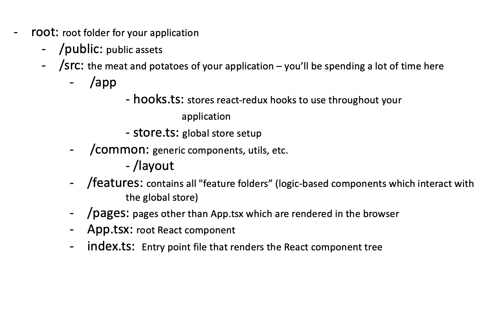

# React Redux Starter Lab

Objective: Learn React and Redux using TypeScript and Redux Toolkit by familiarizing yourself with the file structure, redux global store, features and pages as components, and utitlizing slices to update the global store.

Please note that this activity assumes you have working knowledge of React and Redux with JavaScript. Please refer to the React and Redux documentation for more background/foundation in these areas if needed.

---

## 1. Getting Started

All dependencies necessary to complete this activity are included in the file package.json at the root of your directory. To make the application run locally, begin by inputting `npm install` in the terminal. Then start the application with `npm start`.

 

## 2. Understand the file structure

With Redux Toolkit, you can utilize createSlice() to manage your reducers and action creators. This necessitates a different file structure than what we have used previously. 

Example Directory for this activity:

Please visit the [Redux Style Guide](https://redux.js.org/style-guide/style-guide#structure-files-as-feature-folders-with-single-file-logic) for more information/discussion regarding this file structure. We have a few more folders here than are included in the style guide for organiztion purposes.

 

## 3. Global Store
- Based on the file structure noted above, navigate to store.ts.
- Here we have already configured for you the global state (combined reducer) along with persisted state for local storage. Typing for compatability with TS has also been included here. 
- Consider: how might you access "count" from the global store? Note: you'll need to look at the counterReducer located in ./src/features/counter/counterSlice.ts to better understand how this reducer is structured.

 

## 4. What the Heck is a Slice?
- Slices allow you to manage state and action types all in one! Brilliant, isn't it?
- Read more about their usage with TypeScript here: [Redux Usage with TypeScript: Application Usage](https://redux.js.org/style-guide/style-guide#structure-files-as-feature-folders-with-single-file-logic)
- Refer to ./src/features/counter/counterSlice.ts for a working example. This example includes logic for updating the counter state using thunks, slice actions, and extra actions using "builder." Please make note the the comments included in this file, as they will help you to better understand the function and of each action type.

 

## 5. Let's Bulid Your Own Slice and Update the Global Store
- Within this application, you have the basic structure of a new feature for your application, but it doesn't work... yet!
- Create your own logic for the testFeature.
    - Begin by creating a new slice for testFeature in ./src/features/testFeature
        - you can call this testFeatureSlice.ts
        - remember, you will need to create an initial state and actions to update the state
        - you will not need thunks or builder to implement these basic actions
    - Add a new piece of state to the combined reducer (located in ./src/app/store.ts)
    - Refer to TestFeature.tsx for the goal of this feature: create logic that makes Santa's List work. You will need actions to add names to the list and delete names from the list. Also, consider how you can retrieve data from the global store to show the names you have added to the list.
        - Where can you implement this logic within this file?
        - Refer back to Counter.tsx and counterSlice.ts for examples of implementation

 

A working example of this activity can be found here if you get stuck!: [ts-react-redux-starter-demo](https://github.com/v-walker/ts-react-redux-starter-demo/blob/main/src/features/testFeature/TestFeature.tsx)